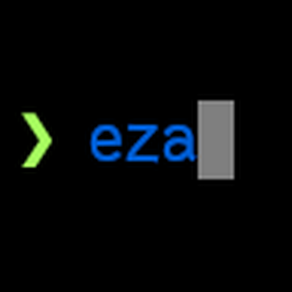

# unraid-eza

This is an eza plugin for **Unraid 7+**.

## description

eza is a modern replacement for the venerable file-listing command-line program ls that ships with Unix and Linux operating systems, giving it more features and better defaults. It uses colours to distinguish file types and metadata. It knows about symlinks, extended attributes, and Git. And it’s small, fast, and just one single binary.

By deliberately making some decisions differently, eza attempts to be a more featureful, more user-friendly version of ls. For more information, see [the eza repository](https://github.com/eza-community/eza).

## dev

Drone builds the plugin source using cargo on a new tag creation.

Tag versions follow eza releases.

## credits

Originally based on the unraid-exa plugin created by [dtomlinson91](https://github.com/dtomlinson91).
